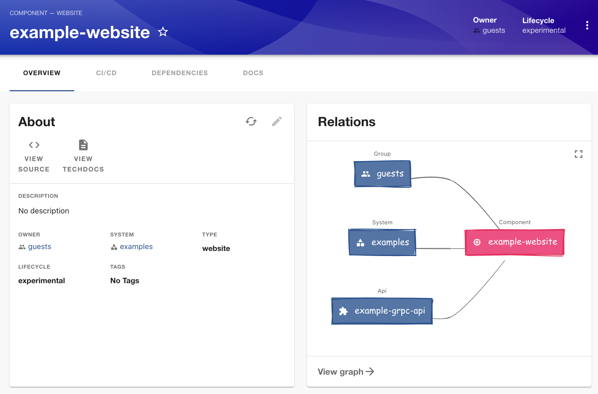

# Catalog Graph Excalidraw

A frontend-only Backstage plugin that provides Excalidraw-style (hand-drawn, sketchy) node and edge renderers for the [catalog graph](https://backstage.io/docs/features/software-catalog/catalog-graph). Use it with `EntityCatalogGraphCard` and `CatalogGraphPage` from `@backstage/plugin-catalog-graph`.



## Installation

Add the plugin to your Backstage app:

```bash
# From your Backstage root directory
yarn add --cwd packages/app @milanmayr/backstage-plugin-catalog-graph-excalidraw
```

## Usage

The plugin exports `ExcalidrawNode` and `ExcalidrawEdge` (and a convenience object `excalidrawGraphRenderers`). Pass them as `renderNode` and `renderEdge` wherever you use the catalog graph.

### 1. Catalog graph page (standalone)

In `packages/app/src/App.tsx`, the file where you render `CatalogGraphPage`:

```tsx
import { CatalogGraphPage, Direction } from '@backstage/plugin-catalog-graph';
import {
  ExcalidrawNode,
  ExcalidrawEdge,
} from '@internal/backstage-plugin-catalog-graph-excalidraw';

// In your routes:
<Route
  path="/catalog-graph"
  element={
    <CatalogGraphPage
      initialState={{ maxDepth: 1, direction: Direction.TOP_BOTTOM }}
      renderNode={ExcalidrawNode}
      renderEdge={ExcalidrawEdge}
    />
  }
/>;
```

### 2. Entity catalog graph cards

In `packages/app/src/components/catalog/EntityPage.tsx`, where you use `EntityCatalogGraphCard`.

Add `renderNode={ExcalidrawNode}` and `renderEdge={ExcalidrawEdge}` to every `EntityCatalogGraphCard` instance (overview cards, diagram tab, etc.) where you want the Excalidraw style:

```tsx
import { EntityCatalogGraphCard } from '@backstage/plugin-catalog-graph';
import {
  ExcalidrawNode,
  ExcalidrawEdge,
} from '@internal/backstage-plugin-catalog-graph-excalidraw';

// For each EntityCatalogGraphCard, add the renderers:
<EntityCatalogGraphCard
  variant="gridItem"
  height={400}
  renderNode={ExcalidrawNode}
  renderEdge={ExcalidrawEdge}
/>;
```

### Convenience object

You can use the bundled object to avoid repeating imports:

```tsx
import { excalidrawGraphRenderers } from '@internal/backstage-plugin-catalog-graph-excalidraw';

<CatalogGraphPage
  renderNode={excalidrawGraphRenderers.renderNode}
  renderEdge={excalidrawGraphRenderers.renderEdge}
/>;
```

## Development

From the plugin directory:

```bash
yarn start
```

This opens a dev app with a sample graph page at `/excalidraw-graph` so you can develop and test the renderers in isolation.

## License

Apache-2.0
